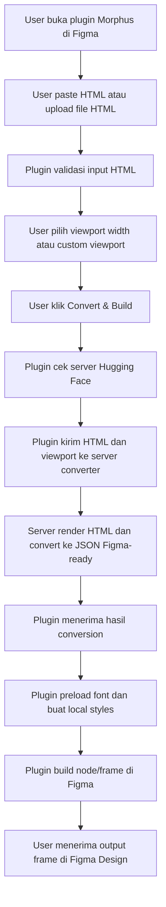
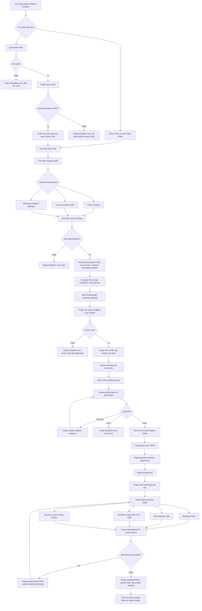

# Alur Sistem Plugin Morphus

Dokumen ini menjelaskan alur dari user memasukkan HTML di plugin sampai user menerima output berupa frame di Figma Design.

## Alur Singkat

## Alur Detail

1. User membuka plugin Morphus di Figma.

2. User memasukkan HTML melalui salah satu cara:
   - paste langsung ke area Paste HTML
   - upload file `.html` atau `.htm`

3. Jika user upload file, plugin melakukan validasi:
   - file harus berupa HTML
   - isi file harus terlihat seperti struktur HTML
   - jika valid, isi file otomatis masuk ke area Paste HTML

4. User masih bisa mengedit isi HTML di area Paste HTML sebelum diproses.

5. User memilih viewport:
   - bisa pilih viewport width yang sudah tersedia
   - bisa memakai custom viewport width
   - bisa memilih beberapa viewport sekaligus

6. User klik tombol `Convert & Build`.

7. Plugin melakukan validasi ulang:
   - HTML tidak boleh kosong
   - HTML harus terlihat valid
   - minimal satu viewport harus dipilih

8. Plugin membuat payload berisi:
   - isi HTML
   - nama sumber HTML
   - viewport utama
   - daftar viewport yang dipilih

9. Plugin mengirim pesan dari UI ke main thread Figma plugin dengan tipe `CONVERT_AND_BUILD`.

10. Main thread plugin menggunakan server converter Hugging Face:
    - server: `https://jehian-tempelhtml.hf.space`
    - health check: `https://jehian-tempelhtml.hf.space/health`

11. Plugin mengecek koneksi server melalui endpoint `/health`.

12. Jika server siap, plugin mengirim HTML dan viewport ke endpoint `/jobs`.

13. Server membuat job conversion dan mengembalikan `jobId` ke plugin.

14. Plugin melakukan polling ke endpoint `/jobs/:jobId` untuk membaca status conversion.

15. Selama proses berjalan, plugin menampilkan indikator progress ke user.

16. Di server, HTML diproses menjadi data Figma-ready:
    - HTML dirender sesuai viewport
    - style, layout, ukuran, teks, warna, gambar, dan struktur halaman dibaca
    - hasilnya diubah menjadi JSON yang bisa dibangun ulang di Figma

17. Setelah conversion selesai, server mengirim hasil JSON ke plugin.

18. Plugin membaca hasil JSON tersebut.

19. Plugin menyiapkan kebutuhan Figma sebelum build:
    - memastikan halaman Figma siap dipakai
    - preload font
    - membuat local styles jika dibutuhkan

20. Plugin membangun desain di canvas Figma:
    - membuat frame
    - membuat text node
    - membuat image/SVG node jika ada
    - menyusun layer sesuai struktur hasil conversion

21. Jika user memilih beberapa viewport, plugin mengulang proses build untuk setiap viewport dan memberi label pada hasilnya.

22. Setelah selesai, plugin menampilkan status `Done`, jumlah node yang dibuat, dan jumlah viewport jika lebih dari satu.

23. User menerima output berupa frame yang sudah muncul di Figma Design dan bisa diedit.

## Output Akhir Untuk User

- Frame muncul langsung di canvas Figma.
- Teks, warna, ukuran, layout, dan elemen visual sudah dibangun dari HTML.
- Hasil bisa diedit seperti desain Figma biasa.
- Jika beberapa viewport dipilih, setiap viewport dibuat sebagai hasil terpisah.
